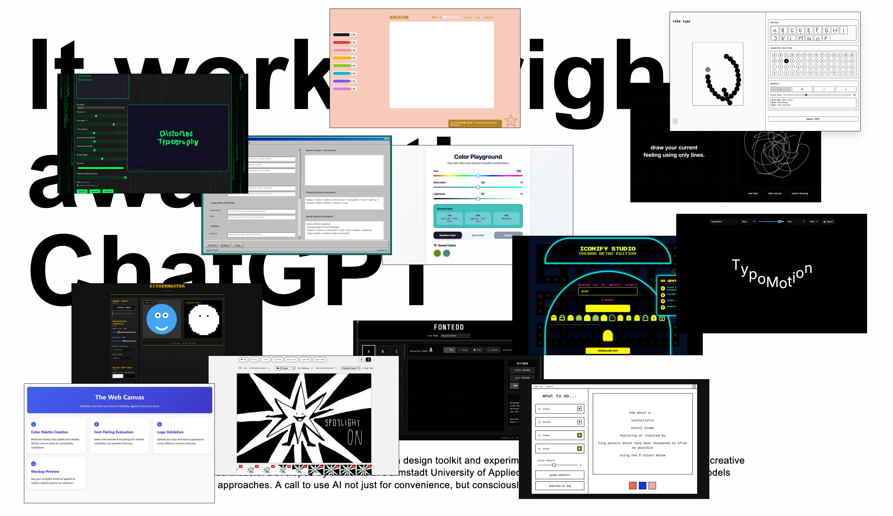

# It worked right away with ChatGPT

**A design toolkit and experiment using AI and vibe coding to expand creative possibilities—without proprietary, closed models.**

## About

This project is a collection of experimental design tools created by students at **Darmstadt University of Applied Sciences**. It demonstrates how open language models can empower designers and enable novel, conscious approaches to creativity—not just for convenience, but for exploration and innovation.

Each tool is built using open-source AI models and web technologies, proving that powerful, creative tools can be developed without relying on closed systems.

## Features

- **13 unique design tools**: From typography editors to color playgrounds, animation tools, and more.
- **Open-source AI**: Built with models like Qwen, DeepSeek, Kimi, and others.
- **Interactive and playful**: Drag, click, and explore each tool in a dynamic, card-based interface.
- **No proprietary models**: All tools are created using open frameworks and assistive AI.

## Tools Included

| Tool                          | Author            | Description                                                                 |
|-------------------------------|-------------------|-----------------------------------------------------------------------------|
| fontedd_brutalisttextmaker    | Anna Schnabel      | Draw and export custom fonts as TTF files.                                  |
| The Web Canvas                | Aron Breuer        | Test colors and fonts against web standards with real-time previews.        |
| Color Playground              | Catalina Buhs     | Manipulate, save, and export HSL color palettes.                            |
| Distorted Typography          | Elizaveta Kircaglo| Experiment with real-time text distortions and effects.                     |
| Prompt Architect              | Emir              | Build structured prompts for image-generation AI tools.                    |
| Iconify Studio                | Gizem             | Generate icons with retro Pacman aesthetics.                                |
| Dithermaster                  | Jonathan Hasse    | Create high-resolution dithered images.                                     |
| Breathe                       | Julia Schöler     | A digital canvas for positive, solitary creativity.                        |
| Vibe Type                     | Kaya Kapotas      | Create fonts from scratch and break traditional design workflows.           |
| TypoMotion                    | Lucie Nauke       | Generate dynamic text animations in real time.                              |
| Draw Your Mind                | Noura Eissa       | Mindfulness and creativity exercises through playful prompts.               |
| The Randominator              | Olivia Wilk       | Spark creativity and overcome art block with random inspiration.            |
| Frame2Frame Animation         | Senay Dogru       | Create stop-motion animations with drawings and imported images.            |

*(See the full list in the app!)*

## How to Use

1. **Explore**: Click on any card to reveal its details.
2. **Interact**: Drag cards around to organize your workspace.
3. **Dive In**: Click "Open Tool" to try each tool in your browser.

## Built With

- **Open AI Models**: Qwen, DeepSeek, Kimi, Gemma, and more.
- **Web Technologies**: HTML, CSS, JavaScript.
- **Open Libraries**: Google Fonts, opentype.js, gifshot.js, and others.

## Try It Out

[Open the Live Demo](#) *(Replace with your live demo link if available)*

## License

This project is open-source and available under the [MIT License](LICENSE).

---

**Developed with ❤️ by students at Darmstadt University of Applied Sciences.**
